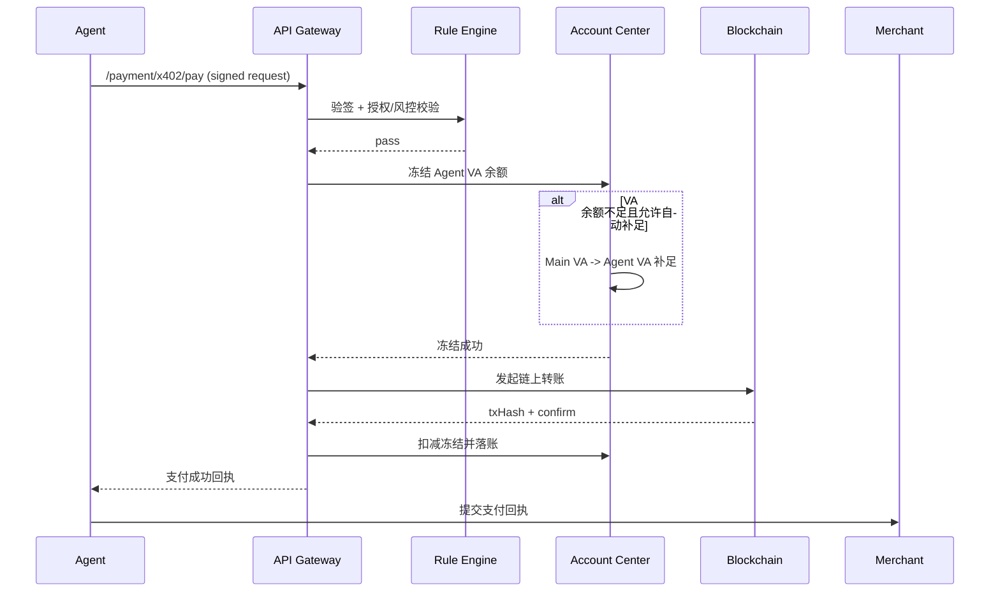
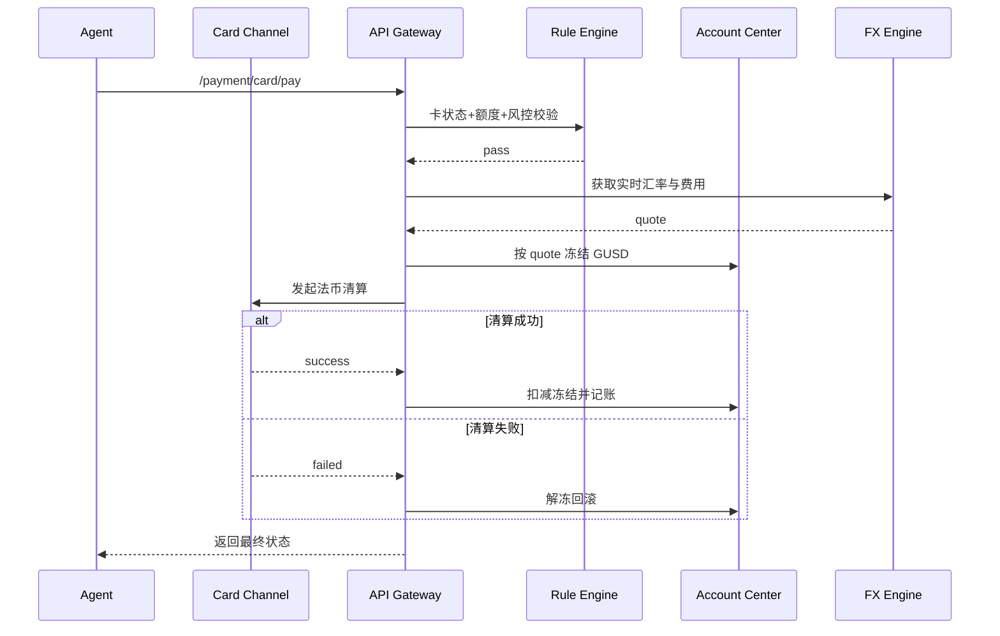

# GUSD 开放 AI 支付系统 - 全整合版（产品 + 商业 + 开发）

## 文档说明

本文档整合开放版 GUSD AI 支付产品架构、商业化付费体系、工程化开发落地全内容，面向项目团队、研发、产品、运营使用，覆盖从产品设计到上线盈利全流程，可直接用于项目立项、开发排期、商业化落地。

## 一、产品核心定位

打造中立开放、全 Agent 兼容、上线即盈利的 AI 原生支付 SaaS 基础设施，以自有 GUSD 稳定币为唯一核心结算资产，聚焦 AI Agent 自动付费、机器间交易、API / 算力结算刚需，实现会员订阅 + 交易抽佣 + 增值服务三层现金流，构建覆盖个人用户、企业团队、AI 商户的全场景 AI 支付生态。

## 二、文字版产品架构（分层模块化）

### 顶层：接入层（全 Agent 开放兼容）

- 通用接入方式：开放 API 网关、跨语言 SDK、MCP 标准插件、x402 协议适配器
- 接入对象：全品类 AI Agent（开源 / 商业 / 私有化 / 企业级）、AI 服务方、商户平台、人类管理端
- 前端载体：Web 管理控制台（个人 / 企业双端口）、H5 移动端、开发者中心

### 第二层：身份鉴权层（全域 Agent DID 体系）

- 核心模块：Agent DID 注册签发、身份签名验证、归属人绑定、身份元数据管理
- 关联能力：DID - 钱包账户绑定、身份黑名单、AI 主体资质核验
- 设计原则：精简身份标识，仅保留核心校验能力，降低开发复杂度

### 第三层：账户核心层（GUSD 双账户体系）

#### 链上 GUSD 钱包模块

- MPC 多签钱包管理、GUSD 链上合约交互、钱包地址生成、链上交易上链存证
- 特色能力：GUSD 自动生息（RWA 美债）、利息结算与复投、资产冷热分离

#### 链下 VA 虚拟账户模块

- VA 账户开立与销户、GUSD-VA 1:1 资产映射、账户余额管理、流水对账
- 子账户管理：支持单用户多 Agent 账户归集、批量管理

### 第四层：支付通道层（全场景付费能力）

#### AI 原生支付通道

- GUSD 原生 x402 协议网关、AI-Agent 点对点转账、API 微支付、批量自动结算
- x402 兼容中转：适配不支持 x402 的交易方，完成代付兜底

#### 传统支付通道

- GUSD 虚拟卡管理、虚拟卡消费结算、商户无感对接、法币等价兑换

#### 资金流转通道

- GUSD 铸币 / 销毁、法币出入金、资金结算、跨境支付

### 第五层：授权与风控层（安全合规核心）

- 人类授权模块：意图化授权、支付额度管控、商户白名单、时效权限设置、大额审批
- 风控合规模块：实时交易风控、基础 KYC/AML 核验、GUSD 链上 KYT、异常交易拦截、审计溯源

### 底层：基础设施层

- 区块链底层：GUSD 发行合约、AgentDID 轻量合约、AI-Pay 结算合约、交易上链
- 技术支撑：高并发网关、分布式存储、MPC 密钥管理、消息队列、定时任务、日志审计

## 三、商业化付费体系（上线即盈利）

### （一）用户分层套餐定价

#### 1. 个人免费版（引流转化）

- 适用对象：个人 AI 玩家、单 Agent 用户
- 权益：
  - 绑定 1 个 Agent，DID 身份免费开通
  - 基础 GUSD 双账户功能（余额查询、基础转账）
  - 单日支付限额 500 GUSD，单笔支付限额 50 GUSD
  - 基础流水查询、GUSD 基础生息收益
- 转化点：限制 Agent 数量、支付额度，引导升级付费版

#### 2. 个人专业版（持续性营收）

- 定价：9.9 USD / 月，89.9 USD / 年（省 20%）
- 适用对象：多 Agent 个人用户、独立 AI 开发者
- 权益：
  - 绑定最多 5 个 AI Agent，子账户统一管理
  - 单日支付限额 2000 GUSD，单笔支付限额 200 GUSD
  - 开通 GUSD 虚拟卡基础版，免开卡费
  - 自定义商户白名单、消费时段管控
  - 自动订阅管理、账单导出、消费提醒
  - GUSD 生息收益上浮 0.5% 年化
  - 专属客服答疑

#### 3. 企业尊享版（高客单价）

- 定价：299 USD / 年，定制版 599 USD / 年
- 适用对象：AI 开发团队、企业级 Agent、API 服务商
- 权益：
  - 无上限绑定 Agent，批量账户管理
  - 定制化支付额度，无常规交易限额
  - GUSD 虚拟卡企业版，多卡管理、额度划拨
  - 高级风控引擎、异常交易实时告警
  - 企业级对账审计、合规报表导出
  - 专属 API 对接、私有化部署适配
  - GUSD 生息收益上浮 1% 年化
  - 1V1 专属技术支持、定制化需求对接

### （二）交易佣金 / 服务费（被动现金流）

- AI-Agent x402 原生交易：免费版 0.5% 手续费，付费版 0.3% 手续费
- GUSD 虚拟卡消费：按单笔消费收取 0.5% 通道费，企业版豁免
- 法币充值：收取 0.2% 服务费；法币提现：收取 0.6% 服务费
- AI 商户入驻：收取 1% 交易流水抽佣

### （三）增值付费服务（高毛利）

- 虚拟卡增值套餐：19.9 USD / 月（额度升级、跨境消费加速、卡安全保障）
- 高级风控审计服务：99 USD / 次（定制化风控规则、链上交易溯源、合规审计报告）
- 私有化接入服务：399 USD / 次（企业私有 Agent 专属 SDK 对接、定制化开发）
- 批量开户服务：199 USD / 月（企业批量开通 Agent 账户、统一资金归集）

## 四、核心 API 列表（研发直接对接）

### （一）Agent 身份 DID API

| API 名称 | 请求方式 | 功能 | 核心入参 | 核心出参 |
| --- | --- | --- | --- | --- |
| `/agent/did/register` | POST | 签发 Agent 唯一 DID 与身份凭证 | Agent 类型、归属人信息、设备标识 | DID 编号、身份公钥、验证凭证 |
| `/agent/did/verify` | POST | 验证 Agent 身份合法性 | DID 编号、签名信息、时间戳 | 验证结果、身份状态 |
| `/agent/did/update` | PUT | 更新 Agent 身份与归属人信息 | DID 编号、更新字段、授权凭证 | 更新结果 |

### （二）GUSD 双账户管理 API

| API 名称 | 请求方式 | 功能 | 核心入参 | 核心出参 |
| --- | --- | --- | --- | --- |
| `/account/create` | POST | 生成 GUSD 链上钱包 + VA 账户 | Agent DID、归属人 ID | 钱包地址、VA 账户 ID、资产映射凭证 |
| `/account/balance/query` | GET | 查询余额与生息收益 | DID 编号、账户 ID | GUSD 余额、待结算利息、总资产 |
| `/account/ledger/query` | GET | 查询交易流水与对账明细 | 账户 ID、时间范围、交易类型 | 流水列表、交易状态、金额详情 |
| `/account/interest/query` | GET | 查询利息与累计收益 | 账户 ID | 年化利率、当日收益、累计收益 |

### （三）人类授权管理 API

| API 名称 | 请求方式 | 功能 | 核心入参 | 核心出参 |
| --- | --- | --- | --- | --- |
| `/authorize/payment/set` | POST | 设置 Agent 支付规则与额度 | 用户 ID、Agent DID、限额、白名单 | 授权凭证、权限生效状态 |
| `/authorize/payment/update` | PUT | 修改授权规则 | 授权 ID、修改字段、验证信息 | 修改结果 |
| `/authorize/freeze` | POST | 紧急管控 Agent 支付权限 | Agent DID、操作类型、原因 | 操作结果 |

### （四）AI 原生支付（x402）API

| API 名称 | 请求方式 | 功能 | 核心入参 | 核心出参 |
| --- | --- | --- | --- | --- |
| `/payment/x402/pay` | POST | Agent 间 GUSD 原生支付 | 付款方 DID、收款方信息、金额 | 交易哈希、支付状态、回执凭证 |
| `/payment/x402/check` | POST | 校验交易到账状态 | 交易 ID、哈希值 | 交易状态、到账金额 |
| `/payment/x402/transfer` | POST | 兼容非 x402 商户代付 | 付款方信息、收款方信息、金额 | 代付结果、交易回执 |

### （五）虚拟卡支付 API

| API 名称 | 请求方式 | 功能 | 核心入参 | 核心出参 |
| --- | --- | --- | --- | --- |
| `/payment/card/apply` | POST | 开通 GUSD 绑定虚拟卡 | Agent DID、VA 账户 ID、额度 | 虚拟卡号、卡状态、绑定信息 |
| `/payment/card/pay` | POST | 虚拟卡传统商户消费 | 虚拟卡号、商户信息、消费金额 | 消费结果、扣款凭证 |
| `/payment/card/manage` | PUT | 卡片冻结、额度调整 | 虚拟卡号、操作类型、调整参数 | 操作结果 |

### （六）资金流转 API

| API 名称 | 请求方式 | 功能 | 核心入参 | 核心出参 |
| --- | --- | --- | --- | --- |
| `/fund/recharge` | POST | 法币兑换 GUSD 入账 | 用户 ID、充值金额、支付方式 | 充值订单、到账状态 |
| `/fund/withdraw` | POST | GUSD 兑换法币提现 | 账户 ID、提现金额、收款账户 | 提现订单、审核状态 |
| `/fund/transfer` | POST | 账户间直接转账 | 付款方账户、收款方地址、金额 | 交易哈希、转账结果 |

### （七）风控与合规 API

| API 名称 | 请求方式 | 功能 | 核心入参 | 核心出参 |
| --- | --- | --- | --- | --- |
| `/risk/transaction/check` | POST | 实时拦截异常交易 | 交易信息、Agent 信息、金额 | 风险等级、是否放行 |
| `/risk/kyc/verify` | POST | 用户合规准入审核 | 用户信息、证件材料 | KYC 结果、核验状态 |
| `/risk/audit/query` | GET | 交易溯源与合规审计 | 交易 ID、DID 编号 | 审计明细、链上存证信息 |

## 五、工程化开发落地细则

### （一）开发设计原则

- 优先变现：围绕充值、扣费、会员、抽佣、虚拟卡核心功能开发，不做冗余功能
- 极简复杂度：单链部署，仅适配 GUSD 稳定币，精简 DID、风控、KYC 模块
- 三层隔离：应用层（业务 / 付费 / 控制台）→ 中台层（账户 / 支付 / 授权）→ 底层（合约 / 通道），解耦清晰
- 无状态接入：Agent 通过 API/SDK/MCP 轻量接入，平台不托管 Agent 本体，仅管控身份 + 资金 + 权限

### （二）微服务拆分（最小可行）

- 用户 & 会员服务：用户注册登录、会员等级管理、套餐订阅、权限管控
- Agent DID 身份服务：DID 签发、签名校验、身份绑定、状态管理
- 账户中心服务：双账户（钱包 + VA）管理、资产映射、流水记账、账户状态
- GUSD 资产 & 生息服务：GUSD 合约交互、每日计息、收益发放、复投管理
- 支付核心服务：x402 交易、点对点转账、自动代扣、交易结算
- 虚拟卡通道服务：虚拟卡发卡、消费对接、额度管理、结算对账
- 授权 & 风控服务：规则引擎、权限校验、异常交易拦截、风险告警
- 订单 & 分佣服务：交易订单生成、手续费计算、商户分润、账单统计
- 资金网关服务：法币充值 / 提现通道对接、资金流转、对账清算
- 开放 API 网关：接口鉴权、流量限流、开发者接入、Webhook 管理

### （三）核心技术选型（直接落地）

| 模块 | 技术选型 | 说明 |
| --- | --- | --- |
| 后端 | Go/Node.js | 高并发适配，适合支付类业务 |
| 数据库 | MySQL + Redis | MySQL 存储核心数据（用户 / 订单 / 账户）；Redis 用于限流、会话、缓存 |
| 消息队列 | MQ/Redis List | 处理异步任务（扣款、账单、通知、生息结算） |
| 定时任务 | 自研 / 第三方定时框架 | 用于每日生息计算、订阅续费、过期资源回收 |
| 钱包方案 | MPC 托管钱包 | 实现 Agent 批量开户、密钥分片管理、交易签名 |
| 身份方案 | 链下 DID + 链上签名 | 轻量化落地，降低链上成本，保证身份可验证 |
| 支付协议 | 标准 x402 + 自研适配 | 兼容标准 HTTP 402，新增 GUSD 原生结算逻辑、中转代付 |

### （四）核心数据库表设计（极简必要）

- `user`：用户主体表（用户 ID、类型、KYC 等级、会员类型、有效期、创建时间）
- `agent_did`：Agent 身份表（DID 编号、公钥、归属人 ID、Agent 类型、状态、创建时间）
- `asset_wallet`：链上钱包表（钱包 ID、Agent ID、钱包地址、MPC 标识、状态）
- `asset_va_account`：VA 账户表（账户 ID、Agent ID、可用余额、冻结余额、资产映射状态）
- `asset_interest_log`：生息记录表（记录 ID、账户 ID、计息日期、收益金额、累计收益）
- `pay_authorize_rule`：支付授权规则表（规则 ID、Agent ID、单笔限额、日 / 月限额、白名单）
- `pay_order`：交易订单表（订单 ID、交易类型、金额、状态、手续费、创建 / 完成时间）
- `member_subscribe`：会员订阅表（订阅 ID、用户 ID、套餐类型、有效期、付费金额）
- `merchant_info`：AI 商户表（商户 ID、商户类型、抽佣比例、结算账户、状态）
- `virtual_card`：虚拟卡表（卡号、Agent ID、额度、状态、有效期、消费记录关联）

### （五）核心业务流程（研发必懂）

#### 1. Agent 自动开户（0 人工）

- 开发者 / 用户通过 API / 控制台提交 Agent 基础信息（类型、用途）
- DID 服务生成唯一 DID 标识 + 签名证书，绑定归属人 ID
- MPC 钱包服务自动创建 Agent 专属链上钱包地址
- 同步创建 VA 链下账户，完成 GUSD 1:1 资产映射
- 初始化默认支付限额、基础风控规则
- 返回接入凭证（DID、钱包地址、API 密钥）

#### 2. 人类给 Agent 授权（风控核心）

- 用户在控制台配置 Agent 支付规则（单笔 / 日 / 月限额、商户白名单、自动续费开关）
- 规则入库并同步至 Redis 缓存，保证支付校验效率
- Agent 发起任何支付请求前，均需经过授权规则引擎校验
- 不满足规则（超限额、非白名单）直接拒绝，不扣款、不上链

#### 3. GUSD 充值链路

- 用户在控制台选择充值金额，生成充值订单
- 通过法币通道（支付宝 / 微信 / 银行卡）完成付款
- 平台确认到账后，调用 GUSD 合约完成铸币
- 铸币完成后，将 GUSD 打入用户 / Agent 对应钱包
- VA 账户同步加账，生成充值账单与流水
- 自动开启每日生息计算

#### 4. AI-Agent x402 支付

- Agent 请求第三方 AI 服务，第三方返回 402 状态码（需支付）
- Agent 调用我方 x402 支付接口，传入付款方 DID、收款方信息、金额
- 规则引擎校验支付额度、白名单，通过后冻结对应金额
- 从 VA 账户扣减余额，发起 GUSD 链上转账
- 监听链上交易确认，返回交易哈希与支付回执
- 第三方服务确认支付后，放行资源；系统扣除手续费、完成分佣记账

#### 5. GUSD 虚拟卡消费

- 用户付费开通虚拟卡（个人专业版 / 企业版权益）
- 虚拟卡与 VA 账户余额打通，同步冻结对应消费额度
- Agent 使用虚拟卡在传统商户消费，触发扣款请求
- 平台实时将 GUSD 兑换为对应法币，通过卡通道完成结算
- 扣减 VA 账户余额与虚拟卡额度，生成消费账单
- 扣除虚拟卡通道费，完成记账

### （六）安全开发约束

- 资金操作强事务：扣款、冻结、上链、退款全部加分布式锁，保证最终一致性，避免超付、重复支付
- 权限管控：Agent 无独立支付权限，所有支出必须依赖人类预设授权规则
- 签名校验：所有 Agent 请求必须携带 DID + 私钥签名，接口层强制校验，防伪造、防篡改
- 冷热分离：日常消费走 VA 链下账户（快速、低成本），大额 / 对外转账走链上钱包（安全、可追溯）
- 分佣自动划转：交易手续费、商户佣金自动拆分至平台账户、商户账户，无需人工干预

## 六、MVP 开发排期（90 天上线盈利）

### 阶段一：基础核心（1-30 天）

- 核心功能：用户注册登录、Agent DID 身份体系、Agent 自动开户
- 账户能力：MPC 钱包对接、GUSD 双账户、基础充值 / 转账、余额查询
- 风控基础：支付授权规则、基础风险拦截、签名校验
- 交付物：基础后台、核心 API、账户模块可正常使用

### 阶段二：商业化变现（31-60 天）

- 会员体系：会员套餐购买、订阅周期管理、会员权益生效
- 变现能力：交易手续费计算、商户分润记账、GUSD 生息体系
- 基础工具：账单、流水、订单管理、简单对账
- 开放能力：开放 API 网关、轻量化 SDK 开发
- 交付物：商业化功能全量落地，可正常收费、生息、分佣

### 阶段三：核心支付（61-90 天）

- 支付核心：x402 协议完整实现、中转代付功能
- 商户体系：AI 商户入驻、抽佣配置、商户结算
- 增值功能：GUSD 虚拟卡全功能（开卡、消费、管理）
- 上线准备：测试、Bug 修复、合规校验、获客准备
- 交付物：全功能上线，可支持 AI 自动付费、商户入驻、虚拟卡消费

## 七、MVP 删减功能（聚焦盈利，降低开发成本）

### 彻底砍掉（0 投入，不占用开发资源）

- 多链兼容、跨链兑换、第三方稳定币对接（仅保留 GUSD 单链）
- 复杂 KYC/AML 全合规模块（仅保留基础归属人核验）
- 复杂链上数据分析、全域身份黑名单
- 第三方生态联动、非核心协议适配
- 小众支付通道、冗余合规模块

### 精简简化（保留核心，减少开发量）

- Agent DID 体系：砍掉复杂身份元数据，仅保留唯一标识、归属绑定、签名校验
- 账户体系：简化多级子账户、复杂资产归集，保留基础分账、批量管理
- 风控系统：移除机器学习风控、大额合规筛查，保留规则化拦截、异常告警
- 支付逻辑：精简小众支付场景，聚焦自动订阅、x402 交易、虚拟卡消费三大核心

## 八、上线盈利核心步骤

- 上线即开放个人专业版、企业尊享版付费套餐，同步开放 GUSD 充值入口，快速实现营收
- 对接 10-20 家 AI API / 算力 / 工具商户，搭建商户收款闭环，反向拉动 C 端用户充值
- 主打「AI 自动付费 + 余额生息」核心卖点，精准触达 AI 开发者社区、Agent 生态用户
- 依托付费权益（多 Agent 绑定、虚拟卡、高额度），转化免费用户，提升付费率
- 小范围内测后，快速推向 AI 生态社区，完成首批付费用户积累，形成正向现金流

## 九、账户与扣款规则 v1（可执行规范）

### （一）账户层级与资金归属

- 统一账户模型：`User Main VA`（用户主账户）+ `Agent VA Subaccount`（Agent 子账户）+ `Agent Wallet`（链上钱包）
- 资金归属原则：用户资金默认入 `User Main VA`，再按规则划拨至各 `Agent VA Subaccount`
- Agent 资金边界：每个 Agent 子账户独立余额、独立冻结、独立流水，不得跨 Agent 直接挪用
- 链上钱包定位：用于大额结算、外部转账、链上存证，不作为日常高频扣款主账户

### （二）虚拟卡绑定规则

- 卡片绑定规则：每张虚拟卡必须唯一绑定一个 `Agent VA Subaccount`
- 多卡支持规则：单 Agent 可绑定多张卡（按商户、用途、地区隔离），单卡不可跨 Agent 复用
- 扣款来源规则：虚拟卡交易默认仅从绑定 Agent 子账户扣款，不直接从链上钱包扣款
- 生命周期规则：卡状态包含 `ACTIVE`、`FROZEN`、`CLOSED`，仅 `ACTIVE` 可发起交易

### （三）双轨支付与扣款优先级

#### 1. 稳定币轨道（x402 / 链上结算）

- 业务场景：Agent 对 Agent、API 微支付、机器间自动结算
- 结算币种：GUSD
- 扣款顺序：
  1. 校验授权规则（限额、白名单、时段、签名）
  2. 扣减 `Agent VA Subaccount` 可用余额
  3. 余额不足时，若开启自动补足则从 `User Main VA` 划拨补足
  4. 补足失败则拒绝交易，不上链
  5. 满足链上直结条件（大额/对外）时发起链上转账

#### 2. 法币轨道（虚拟卡/法币商户）

- 业务场景：传统商户消费、订阅续费、卡通道支付
- 账户记账币种：GUSD（统一账本）
- 清算展示币种：USD/EUR/JPY 等法币（按商户币种展示）
- 扣款顺序：
  1. 校验卡状态、卡额度、授权规则、风控策略
  2. 冻结对应 GUSD 金额（按实时汇率折算）
  3. 卡通道完成法币清结算
  4. 成功则扣减冻结并记账；失败则全额解冻回滚

### （四）自动补足（Auto Top-up）规则

- 开关级别：支持平台默认、用户级、Agent 级三级开关
- 补足来源：仅允许 `User Main VA -> Agent VA Subaccount` 单向补足
- 补足上限：支持单笔补足上限、日补足上限、月补足上限
- 失败策略：补足失败直接返回余额不足，不允许隐式透支

### （五）汇率、费用与计费时点

- 汇率来源：统一使用平台配置的汇率源（可多源加权），对外展示汇率时间戳
- 费用组成：交易手续费 + 卡通道费 + 汇率点差（如启用）
- 计费时点：
  - 稳定币交易：以扣款确认时计费
  - 法币交易：以冻结成功时预估、清算完成时最终结算差额
- 差额处理：若清算汇率与冻结汇率存在偏差，按规则补扣或退回，并记录差额流水

### （六）交易状态机（统一标准）

- 主状态：`INIT` -> `AUTHORIZED` -> `FROZEN` -> `SETTLING` -> `SETTLED`
- 失败状态：任意阶段可进入 `FAILED`
- 逆向状态：已结算交易可进入 `REFUNDING` -> `REFUNDED`
- 关闭状态：超时未完成进入 `EXPIRED`
- 状态约束：状态变更必须幂等，且仅允许单向前进（退款链路除外）

### （七）幂等与一致性规则

- 幂等键：所有扣款/退款/补足接口必须强制传入 `Idempotency-Key`
- 并发控制：同一 `Agent VA Subaccount` 的资金变更需加分布式锁
- 记账顺序：先冻结、后清算、再落账；任何异常必须触发补偿任务
- 最终一致性：链上回执、卡通道回执、账本状态三方对账不一致时进入人工/自动补偿队列

### （八）风控前置与拦截规则

- 前置校验：未通过 DID 签名校验的请求直接拒绝
- 授权校验：超单笔/日/月限额、非白名单商户、禁用时段交易直接拒绝
- 风险分级：`LOW`（放行）、`MEDIUM`（二次确认/降额）、`HIGH`（拦截）
- 高风险策略：高风险交易不允许先扣后审，必须先审后扣

### （九）标准错误码（v1）

| 错误码 | 含义 | 处理建议 |
| --- | --- | --- |
| `PAY-001` | DID 签名校验失败 | 检查签名、公钥、时间戳 |
| `PAY-002` | 授权规则不通过 | 检查限额、白名单、时段 |
| `PAY-003` | Agent VA 余额不足 | 充值或开启自动补足 |
| `PAY-004` | 自动补足失败 | 检查主账户余额与补足上限 |
| `PAY-005` | 虚拟卡状态不可用 | 检查卡是否冻结/销户/过期 |
| `PAY-006` | 风控拦截 | 进入人工复核或调整规则 |
| `PAY-007` | 通道超时 | 发起状态查询与重试 |
| `PAY-008` | 幂等冲突 | 使用新幂等键重试非重复请求 |
| `PAY-009` | 清算失败已回滚 | 读取失败原因并重试 |
| `PAY-010` | 系统繁忙 | 指数退避重试 |

### （十）新增/补充 API 建议（落地优先）

| API 名称 | 请求方式 | 功能 | 核心入参 | 核心出参 |
| --- | --- | --- | --- | --- |
| `/account/va/transfer` | POST | 主 VA 向 Agent VA 划拨 | 用户 ID、Agent DID、金额 | 划拨流水 ID、结果 |
| `/account/va/topup/config` | PUT | 配置自动补足规则 | 用户 ID、Agent DID、开关、限额 | 配置结果 |
| `/payment/debit/preview` | POST | 交易前费用与汇率试算 | Agent DID、金额、商户币种、场景 | 预估扣款、费率明细、汇率 |
| `/payment/status/query` | GET | 统一查询交易状态 | 交易 ID、幂等键 | 当前状态、失败原因、回执 |
| `/payment/refund/apply` | POST | 发起退款 | 原交易 ID、退款金额、原因 | 退款单号、处理状态 |

### （十一）实施优先级（建议）

- P0（必须）：账户层级、扣款优先级、状态机、幂等、错误码
- P1（高优先）：自动补足、费用试算、统一状态查询
- P2（增强）：多卡策略、复杂补偿编排、高级风险分层

### （十二）研发交付版 API 示例（JSON）

#### 1. 主 VA 向 Agent VA 划拨 `/account/va/transfer`

请求示例：

```json
{
  "userId": "u_10001",
  "agentDid": "did:gusd:agent:hermes_001",
  "amount": "120.50",
  "currency": "GUSD",
  "reason": "agent_budget_topup",
  "idempotencyKey": "idem_20260422_transfer_0001"
}
```

成功响应示例：

```json
{
  "code": "0",
  "message": "ok",
  "data": {
    "transferId": "vatr_202604220001",
    "status": "SETTLED",
    "fromAccountId": "va_main_u_10001",
    "toAccountId": "va_agent_hermes_001",
    "amount": "120.50",
    "currency": "GUSD",
    "ledgerTime": "2026-04-22T10:02:11Z"
  }
}
```

#### 2. 配置自动补足 `/account/va/topup/config`

请求示例：

```json
{
  "userId": "u_10001",
  "agentDid": "did:gusd:agent:hermes_001",
  "enabled": true,
  "singleLimit": "50",
  "dailyLimit": "500",
  "monthlyLimit": "5000",
  "triggerThreshold": "10",
  "idempotencyKey": "idem_20260422_topup_cfg_0001"
}
```

成功响应示例：

```json
{
  "code": "0",
  "message": "ok",
  "data": {
    "configId": "topup_cfg_10001",
    "status": "ACTIVE",
    "effectiveAt": "2026-04-22T10:05:00Z"
  }
}
```

#### 3. 扣款试算 `/payment/debit/preview`

请求示例：

```json
{
  "agentDid": "did:gusd:agent:openclaw_007",
  "scene": "CARD_PURCHASE",
  "amountFiat": "19.99",
  "fiatCurrency": "USD",
  "merchantId": "m_aws_proxy_01"
}
```

成功响应示例：

```json
{
  "code": "0",
  "message": "ok",
  "data": {
    "quoteId": "quote_202604220012",
    "fxRate": "1.0000",
    "fxTimestamp": "2026-04-22T10:07:00Z",
    "debitAmountGusd": "20.19",
    "feeBreakdown": {
      "serviceFee": "0.10",
      "channelFee": "0.10",
      "fxSpreadFee": "0.00"
    },
    "expireAt": "2026-04-22T10:08:30Z"
  }
}
```

#### 4. x402 支付 `/payment/x402/pay`

请求示例：

```json
{
  "payerDid": "did:gusd:agent:hermes_001",
  "payee": {
    "type": "MERCHANT",
    "merchantId": "m_model_vendor_01"
  },
  "amount": "3.25",
  "currency": "GUSD",
  "memo": "api_inference_call",
  "signature": "base64_signature_value",
  "timestamp": "2026-04-22T10:10:01Z",
  "idempotencyKey": "idem_20260422_x402_0009"
}
```

成功响应示例：

```json
{
  "code": "0",
  "message": "ok",
  "data": {
    "transactionId": "txn_202604220009",
    "status": "SETTLING",
    "freezeAmount": "3.25",
    "currency": "GUSD",
    "txHash": "0xabc123...",
    "receiptId": "rct_202604220009"
  }
}
```

#### 5. 统一状态查询 `/payment/status/query`

请求示例：

```json
{
  "transactionId": "txn_202604220009",
  "idempotencyKey": "idem_20260422_x402_0009"
}
```

成功响应示例：

```json
{
  "code": "0",
  "message": "ok",
  "data": {
    "transactionId": "txn_202604220009",
    "status": "SETTLED",
    "finalAmount": "3.25",
    "currency": "GUSD",
    "failureCode": "",
    "updatedAt": "2026-04-22T10:10:08Z"
  }
}
```

失败响应示例：

```json
{
  "code": "PAY-003",
  "message": "agent va insufficient balance",
  "data": {
    "transactionId": "txn_202604220010",
    "status": "FAILED",
    "suggestion": "recharge or enable auto top-up"
  }
}
```

### （十三）状态流转时序图（Mermaid）

#### 1. x402 支付时序（VA 扣款优先）



#### 2. 虚拟卡法币消费时序（GUSD 记账）



### （十四）后端实现约束清单（可直接拆任务）

- 网关层必须统一注入：`requestId`、`idempotencyKey`、`timestamp`、`signVersion`
- 账户层必须实现：冻结、扣减、解冻、补偿四个原子动作
- 交易表必须记录：业务场景、渠道、汇率快照、费用快照、状态迁移日志
- 定时任务必须覆盖：超时交易关闭、通道补查、链上补查、对账补偿
- 告警规则必须覆盖：连续失败率、补偿堆积、对账差异、风控拦截异常峰值
- 所有金额字段统一使用字符串十进制，禁止浮点存储与计算

## 十、托管到自托管的产品演进路线（体验优先 + 信任增强）

### （一）核心演进原则

- MVP 阶段优先体验：默认平台托管，目标是让 Agent 快速可支付
- 增长期增强信任：逐步开放用户绑定自有钱包（自托管）
- 双轨并行长期形态：小额高频走托管，大额敏感走自托管授权
- 资产归属不变：无论托管或自托管，用户始终为资金实际所有人

### （二）三阶段路线图

#### 阶段 A（0-3 个月）：平台托管模式（默认）

- 钱包模型：平台 MPC 托管地址 + 用户主 VA + Agent 子 VA
- 用户体验：注册后即可充值并授权 Agent 消费，10 分钟内跑通首笔支付
- 安全基线：签名校验、限额、白名单、幂等、可追溯流水
- 商业目标：验证支付闭环与交易抽佣模型，优先获取真实交易数据

#### 阶段 B（3-6 个月）：可选自托管绑定模式（灰度）

- 新增能力：用户连接自有钱包（如 EVM 钱包），绑定到用户账户
- 授权模型：用户签发会话授权（额度、币种、有效期、用途）
- 执行策略：小额仍可自动托管扣款，大额触发自托管签名确认
- 发布策略：先面向企业版和高活跃开发者灰度开放

#### 阶段 C（6-12 个月）：托管/自托管混合策略（稳定）

- 策略中心：支持按场景配置资金路径（订阅、API 调用、跨境、商户消费）
- 路由规则：按金额、风险等级、商户类型自动选择托管或自托管轨道
- 信任增强：上线储备证明、第三方审计与关键链上地址公开
- 运营目标：覆盖“追求效率”与“追求主权”两类用户

### （三）权限模型（Agent 可支付但不可失控）

- 用户主权限：创建/冻结 Agent、设置预算、调整白名单、撤销授权
- Agent 执行权限：仅在授权范围内发起支付请求，无直接提币权限
- 会话授权对象：`agentDid + scene + amountLimit + expireAt + nonce`
- 高风险保护：超过阈值或命中高风险策略，强制用户二次签名确认

### （四）关键交互流程（自托管绑定）

#### 1. 绑定流程

1. 用户在控制台选择“绑定自有钱包”
2. 前端发起钱包连接并请求用户签名绑定消息
3. 后端校验签名并完成 `userId <-> walletAddress` 绑定
4. 平台生成默认授权模板（额度/时效/场景）

#### 2. 支付流程（混合模式）

1. Agent 发起支付请求
2. 策略引擎判断：托管自动扣款 or 自托管签名路径
3. 托管路径：直接按第九节规则冻结并结算
4. 自托管路径：推送签名请求给用户钱包，签名成功后结算
5. 全链路回写统一交易状态与账单

### （五）新增 API 建议（自托管方向）

| API 名称 | 请求方式 | 功能 | 核心入参 | 核心出参 |
| --- | --- | --- | --- | --- |
| `/wallet/bind` | POST | 绑定用户自有钱包 | 用户 ID、钱包地址、签名消息、签名值 | 绑定状态、钱包标签 |
| `/wallet/unbind` | POST | 解绑自有钱包 | 用户 ID、钱包地址、二次验证 | 解绑结果 |
| `/authorize/session/create` | POST | 创建会话授权 | 用户 ID、Agent DID、额度、时效、场景 | 授权 ID、授权凭证 |
| `/authorize/session/revoke` | POST | 撤销会话授权 | 授权 ID、用户签名 | 撤销结果 |
| `/payment/sign/request` | POST | 创建待签名交易请求 | 交易 ID、钱包地址、交易摘要 | 签名请求 ID、过期时间 |
| `/payment/sign/submit` | POST | 提交用户签名并结算 | 签名请求 ID、签名值 | 交易状态、回执 |

### （六）风控与合规差异化策略

- 托管模式：平台承担更多风控责任，默认更严格限额与频控
- 自托管模式：用户确认责任增强，但仍保留商户白名单与黑名单拦截
- 共通规则：异常设备、异常 IP、异常频次统一触发风险分级
- 审计要求：托管与自托管交易均输出可审计事件日志

### （七）对外产品话术（建议统一）

- 默认模式：`开箱即用，10 分钟让 Agent 获得支付能力`
- 进阶模式：`需要更高资金主权时，可一键切换到自托管授权`
- 平台定位：`不改变用户资产所有权，只提供可控、可审计的支付执行层`

## 十一、MVP 开发任务清单与联调顺序（30 天可上线版）

### （一）MVP 范围冻结（本期只做）

- Agent 开户：`/agent/did/register`、`/account/create`
- 稳定币充值入账：`/fund/recharge`（可先人工审核后入账）
- 授权规则：`/authorize/payment/set`（单笔、单日、白名单）
- 稳定币支付：`/payment/x402/pay`、`/payment/status/query`
- 查询能力：`/account/balance/query`、`/account/ledger/query`

### （二）非 MVP 范围（明确延期）

- 虚拟卡支付、法币出入金通道
- 多链与跨链
- 自托管钱包绑定
- 机器学习风控与高级合规编排
- 企业私有化部署

### （三）后端任务拆解（按优先级）

#### P0：核心交易闭环

- 建立账户原子能力：`freeze`、`debit`、`unfreeze`、`refund`
- 实现 DID 签名校验中间件与请求时效校验
- 实现授权规则引擎（单笔/日限额 + 白名单）
- 实现 `x402` 支付主流程：校验 -> 冻结 -> 扣减 -> 状态回写
- 实现幂等控制：所有资金变更接口强制 `Idempotency-Key`

#### P1：稳定性与可观测

- 异步补偿任务：超时关闭、失败回滚、状态补查
- 对账任务：账本与订单一致性校验（日级）
- 结构化日志：`requestId`、`transactionId`、`agentDid`、`errorCode`
- 告警规则：支付失败率、回滚率、补偿堆积、接口超时

### （四）前端任务拆解（控制台最小可用）

- 登录后首页：用户余额、今日支出、最近交易
- Agent 管理页：创建 Agent、查看 DID、状态启停
- 授权页：设置限额、白名单、授权开关
- 充值页：提交充值申请、查看到账状态
- 交易页：交易列表、交易详情、失败原因展示

### （五）测试任务拆解（必须覆盖）

- 单元测试：授权规则、金额计算、状态机迁移、幂等逻辑
- 集成测试：开户 -> 充值 -> 授权 -> 支付 -> 查询全链路
- 异常测试：余额不足、重复请求、超时回调、并发扣款
- 回归测试：核心 API 返回码与错误码一致性
- 压测基线：支付接口 P95 响应时间与稳定性验证

### （六）API 联调顺序（严格按序）

1. `POST /agent/did/register`（拿 DID）
2. `POST /account/create`（拿 Agent VA 与钱包地址）
3. `POST /fund/recharge`（给主 VA 或 Agent VA 入账）
4. `POST /authorize/payment/set`（下发支付规则）
5. `POST /payment/x402/pay`（发起支付）
6. `GET /payment/status/query`（查询最终状态）
7. `GET /account/balance/query`（校验余额）
8. `GET /account/ledger/query`（校验流水与手续费）

### （七）接口联调验收用例（最小 10 条）

- 正常支付成功（授权通过、余额充足）
- 单笔超限拦截（`PAY-002`）
- 日限额超限拦截（`PAY-002`）
- 非白名单商户拦截（`PAY-002`）
- 余额不足失败（`PAY-003`）
- 同幂等键重复请求不重复扣款（返回同交易结果）
- 通道超时后状态补查成功（`SETTLING -> SETTLED`）
- 通道失败后自动回滚（`FAILED` 且余额恢复）
- 签名错误拦截（`PAY-001`）
- 交易后账本与流水一致（金额、手续费、状态一致）

### （八）30 天排期（按周）

- 第 1 周：建表、鉴权中间件、DID 与账户创建 API
- 第 2 周：授权规则、余额/流水查询、充值入账流程
- 第 3 周：x402 支付主流程、幂等、回滚与状态查询
- 第 4 周：前端最小页、联调、压测、灰度上线

### （九）上线验收标准（Definition of Done）

- 新用户 10 分钟内完成 Agent 开户并跑通首笔支付
- 支付成功率不低于 95%
- 并发重试场景下重复扣款事件为 0
- 所有失败交易可定位到标准错误码
- 日终账本可对平（交易金额与手续费一致）
- 关键告警生效（失败率、超时、回滚、补偿）
